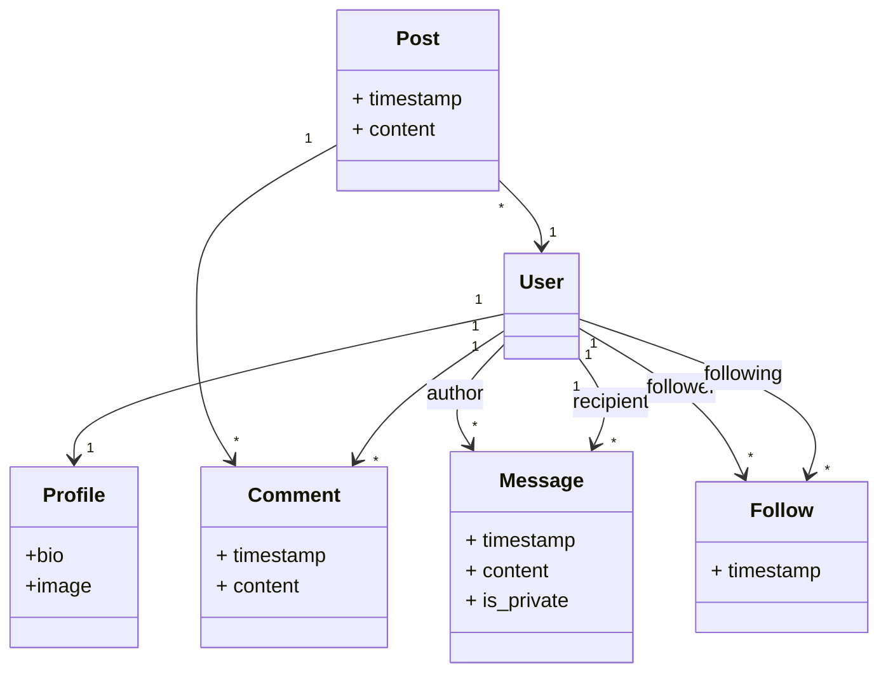

```mermaid
classDiagram
	class User {
		} 
	class Profile {
		+bio 
		+image
		}
	class Post {
		+ timestamp
		+ content
		}
	class Comment {
		+ timestamp
		+ content
		}
	class Message {
		+ timestamp
		+ content
		+ is_private
		}
	class Follow {
		+ timestamp
		}
	Post "*" --> "1" User
	User "1" --> "1" Profile
	Post "1" --> "*" Comment 
	User "1" --> "*" Comment
	User "1" --> "*" Message : author
	User "1" --> "*" Message : recipient
	User "1" --> "*" Follow : follower
	User "1" --> "*" Follow : following
	
	
```
